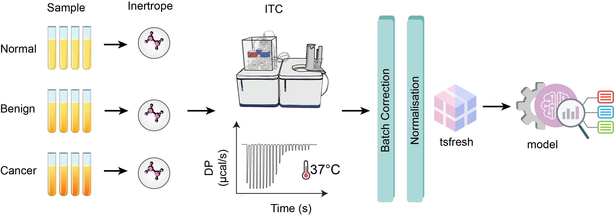

# Inertrope

Inertrope is a machine learning–based multiclass framework designed to classify patient ITC (Isothermal Titration Calorimetry) data into **normal**, **benign**, or **cancer** categories. The pipeline combines robust normalization, feature engineering, and a multiclass classification model, making it a practical and interpretable tool for clinical applications.

---


<br>
<div align="center">
</div>
<br>

<div align="left">

<div align="left">

<p>
  
  
  
  
  
  [](https://colab.research.google.com/drive/1qTmiELb_6tsbV7xuU1IcY-cAZSlWAIrt?usp=sharing)
  [](https://github.com/the-ahuja-lab/Inertrope/)
    
  </a>
  <a href="https://github.com/YOUR_USERNAME/YOUR_REPO">
    
  </a>
</p>

</div>


## Introduction

Isothermal Titration Calorimetry (ITC) generates thermodynamic binding data that often require careful normalization before they can be reliably used for downstream classification. Inertrope addresses this by:

1. **Normalizing ITC data** to correct baseline drift and batch effects.
2. **Extracting features** relevant to differential thermodynamic profiles.
3. **Training a multiclass ML model** capable of discriminating between *normal*, *benign*, and *cancer* cohorts.

This stepwise approach ensures reproducibility, clinical interpretability, and scalability.

---

## Dependencies

### Strong dependency

- **RDKit** (for molecular feature integration, optional but recommended)

```bash
conda create -c conda-forge -n inertrope
conda activate inertrope

```

### Major dependencies

- **pandas**
- **numpy**
- **scikit-learn (v1.0.2 or higher)**
- **matplotlib**
- **tqdm**
- **joblib**

Install directly:

```bash
pip install pandas numpy scikit-learn matplotlib tqdm joblib

```

### Optional dependencies

- **tsfresh** (time-series feature extraction for ITC thermograms)
- **lime** (model interpretability)

```bash
pip install tsfresh lime

```

---

## Installation

Inertrope can be installed directly via pip:

```bash
pip install inertrope

```

For development mode (from source):

```bash
git clone https://github.com/yourlab/inertrope.git
cd inertrope
pip install -e .

```

---

## License Key

- **Academic use**: Free for research and educational institutions.
- **Commercial use**: Requires a license key. Contact us for details.

---

## Workflow Overview

The Inertrope pipeline consists of **three major steps**:

1. **ITC Data Normalization**
    - Baseline correction
    - Heat per injection normalization
    - Replicate merging
2. **Feature Extraction**
    - Thermodynamic descriptors (ΔH, ΔS, binding enthalpy profiles)
    - Statistical descriptors (mean, variance, slope)
    - Optional: tsfresh time-series features
3. **Multiclass Model Training**
    - Targets: **Normal**, **Benign**, **Cancer**
    - Models: RandomForest, XGBoost, Logistic Regression
    - Cross-validation with metrics (Accuracy, F1, AUC)
    - Export trained model as `.pkl`

---

## Quick Start

```bash
# Step 1: Normalize ITC data
python inertrope.py --input raw_itc.csv --output normalized_itc.csv --mode normalize

# Step 2: Train multiclass model
python inertrope.py --input normalized_itc.csv --output model.pkl --mode train

# Step 3: Inference on new samples
python inference.py -i new_itc.csv -m model.pkl -o predictions.csv

```

---

## Example Notebook

A Colab demo notebook is available:

👉 Inertrope Colab Demo 

---

## Outputs

- **Normalized Data**: `normalized_itc.csv`
- **Prediction Results**: `predictions.csv` with probabilities for Normal, Benign, Cancer

---

## Interpretability

- **LIME**: Explains feature contribution to individual predictions.
- **SHAP** : Global and local interpretability plots.
